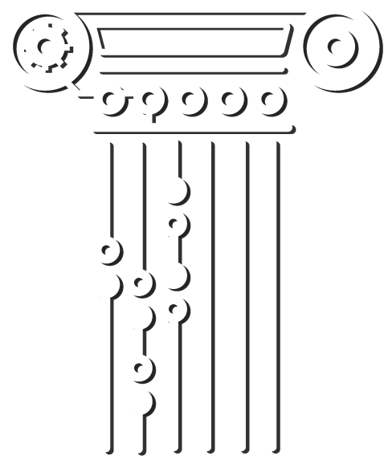
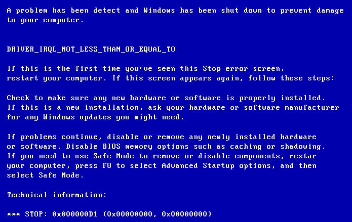
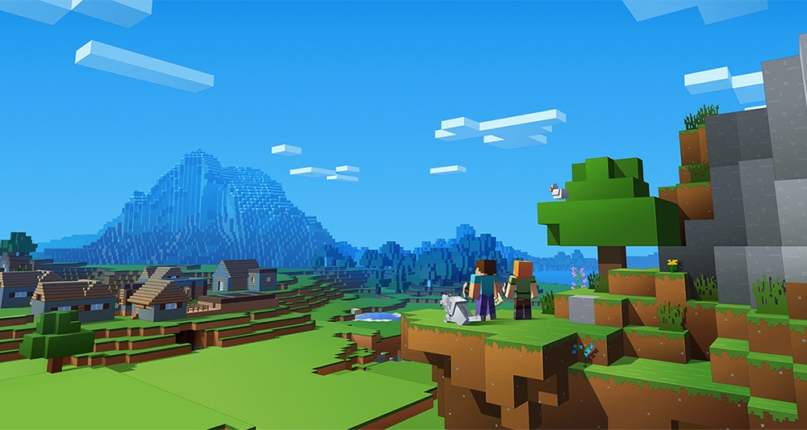
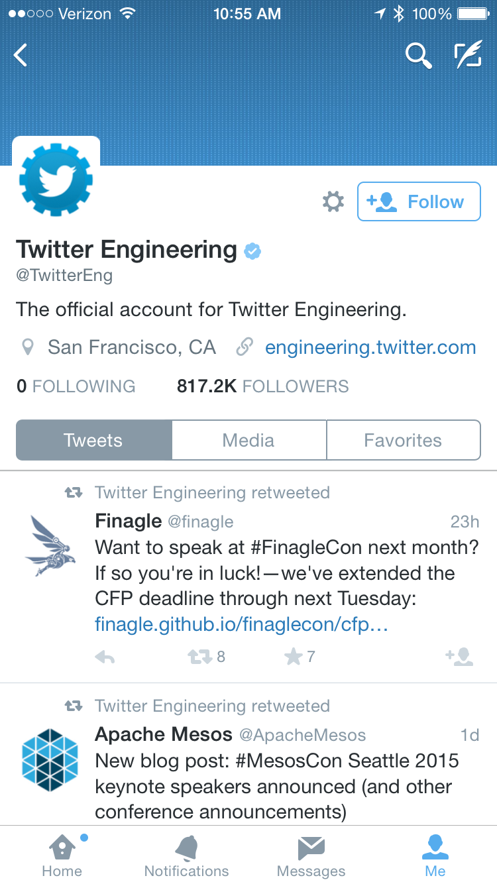
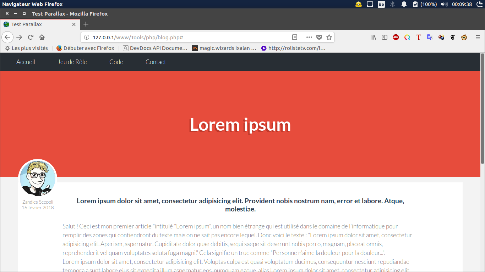
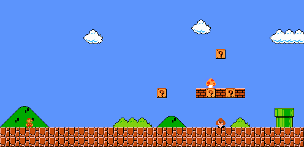
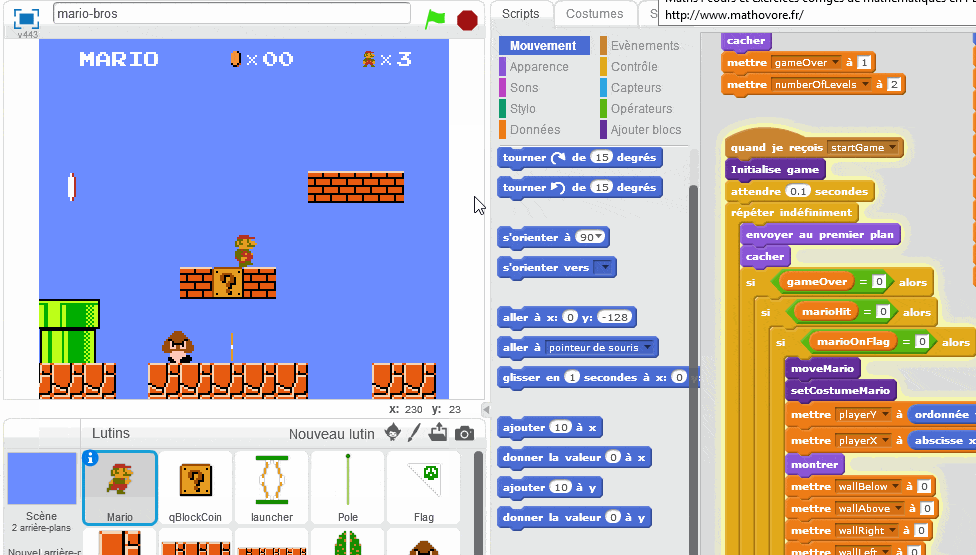
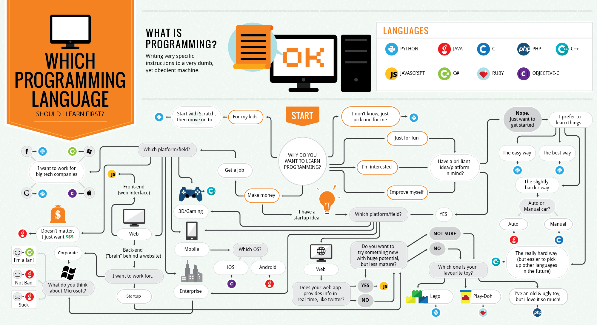

<!-- 

Club de <strong>Programmation</strong>

 -->

Cours d'initiation à la programmation
=====================================
@ilio Discepoli
Nicolas Gallis
Lucas Placentino

<!-- 

	

		
Ce cours est destiné aux personnes souhaitant s'initier à la programmation informatique. Tout le code de cette page est disponible sur<a href="https://github.com/Zandies/Cours-Programmation" target="_blank">GitHub</a>.

	

 -->

	

		
Ce cours est destiné aux personnes souhaitant s'initier à la programmation informatique. Tout le code de cette page est disponible sur<a href="https://github.com/Zandies/Cours-Programmation" target="_blank">GitHub</a>.

	

<!-- 

	

		
Ce cours est destiné aux personnes souhaitant s'initier à la programmation informatique. Tout le code de cette page est disponible sur<a href="https://github.com/Zandies/Cours-Programmation" target="_blank">GitHub</a>.

	

 -->
### Sommaire

* [C'est quoi la programmation ?](#prog)
	* [Pourquoi apprendre la programmation ?](#pk)
	* [Comment ca marche ?](#comment)
* [Quel langage choisir ?](#choix)
	* [Pour faire quoi ?](#pfk)
	* [Web ou machine ?](#)
	
<!-- --- Contenu --- -->

1. C'est quoi la programmation ? 

	La programmation, c'est juste communiquer avec un ordinateur pour lui demander d'effectuer des actions pour nous. Bien que cela puisse sembler difficile d'un premier abord, la programmation est un univers accessible à n'importe qui, pourvu qu'on soit motivé. C'est comme parler dans une autre langue, on doit retenir des règles pour ensuite les appliquer et ainsi se faire comprendre par les personnes qui la parlent.
	Programmer, c'est créer des programmes. Il y'en a partout, aussi bien sur votre PC que sur votre smartphone en passant par les consoles et les appareils photos. Dites vous que tout ce qu'il y'a sur votre PC est programme; Google Chrome, Skyrim, Word, Photoshop, League Of Legends, le bloc-notes de Windows, Skype...

	1. Pourquoi apprendre la programmation ? 

		C'est une question légitime. De un, la programmation vous initie à une nouvelle façon de penser, quand vous aurez un petit bagage dans le monde du dévelopemment, vous verrez que ne pourrez vous empêcher d'imaginer la structure d'un programme que vous utiliser (aussi bien un site web qu'on jeu vidéo). De deux, ça vous apprend plein de chose sur l'informatique en général (comment fonctionne Internet, comment marche un PC, comprendre les messages d'erreurs barbares de Windows, <strike>pirater le réseau WiFi de l'école</strike>, ...)
		<figure>
			
			<figcaption>Une belle erreur comme on l'aime</figcaption>
		</figure>

	2. Comment ça marche ? 
		Pour programmer, c'est tres simple. Il suffit de choisir un langage, de l'apprendre pour ensuite développer ce que l'on veut avec. Le code est ensuite interpreté par l'ordinateur pour pouvoir être executé. Il faut choisir un langage en fonction de vos envies (site web, jeu vidéo, logiciel,...)

2. Quel langage choisir ?
	
	Voici le premier vrai dilemme : Quel langage faut-il choisir ?
	Tout cela dépend de ce que vous voulez faire, je m'explique, si vous préferez coder des sites web, optez pour l'<strong style="color:#e74c3c;">HTML/CSS</strong>. Si vous préfèrez le monde des jeux vidéos(1), le choix est beaucoup plus vaste: <strong style="color:#f1c40f;">C/C++, Python, Java, C#</strong>... Sinon, vous pouvez développez des applications IOS(2) avec le langage <strong style="color:#e67e22;">Swift</strong> ou l'<strong style="color:#e67e22;">Objective-C</strong>. Si vous êtes plutôt du genre à automatiser des tâches sur votre PC, il y'a le <strong style="color:#2ecc71;">Shell</strong>. 
	En bref, il existe des centaines de langages différents, pour tous les goûts, en cherchant un peu vous trouverez sûrement celui qui vous parle :wink:
	<figure id="example_code">
		
		<figcaption>(1) Minecraft, le jeu vidéo développé en Java</figcaption>
		
		<figcaption>(2) Twitter, une application dévelopée en Swift</figcaption>
	</figure>
	
	1. Je ne sais pas ce que j'aimerais faire, mais je veux vite voir le résultat ! 
		

		

		
Je ne sais pas ce que j'aimerais faire, mais je veux vite voir le résultat !

		

		

		Alors là, je peux vous aider. 
		Si vous voulez commencer en douceur, apprennez le HTML/CSS qui permet de créer des sites web, c'est l'un des langage les plus faciles à apprendre, il est très simple à comprendre et c'est extrêmement visuel.
		<figure id="example_site">
			
			<figcaption>Un site web développé en HTML/CSS</figcaption>
		</figure>
		Sinon, si vous êtes plus du genre jeux vidéo, il y a le Python qui permet d'en créer très simplement.
		<figure id="example_site">
			
			<figcaption>Un jeu dévelloppé en python</figcaption>
		</figure>
		D'autre part, Apple à développé son propre langage qui permet de créer des applications pour appareils IOS assez simplement. Il s'agit de Swift. Au niveau de la "difficulté" à l'apprendre, il est presque identique au Python.
		<figure id="swift">
			
			<figcaption>Swift</figcaption>
		</figure>

		Sinon, il existe des logiciels comme Scratch ou Swift Playground qui permet d'apprendre le développement en utilisant des "blocs".
		<figure id="scratch">
			
			<figcaption>Le logiciel Scratch</figcaption>
		</figure>

		

			
J'ai vu sur Internet que pour développer un jeu comme World Of Warcraft, il fallait apprendre le C++, je crois que c'est celui là que je vais prendre ! Ok ? Je peux ?

			

		

		Bien sûr que vous pouvez, mais attention, il faudra vous accrochez, sinon vous serez dégoûtés par le développement, car certains concepts sont assez difficiles à comprendre, et si vous commencez directement avec un language très puissant maisplus difficile vous riquez de vous perdre et de ne plus rien comprendre. Je vous conseille donc de prendre un language plus "facile" mais rien ne vous empêche d'apprendre un languague plus dur.
		
		

		
Plus faciles
|
Plus durs

		-:|:-
		Python|C++
		HTML/CSS|Java
		PHP|C#
		Swift|Assembleur
		...|...

		

		<figure id="scratch">
			
			<figcaption>Un diagramme pour aider dans le choix d'un langage</figcaption>
		</figure>